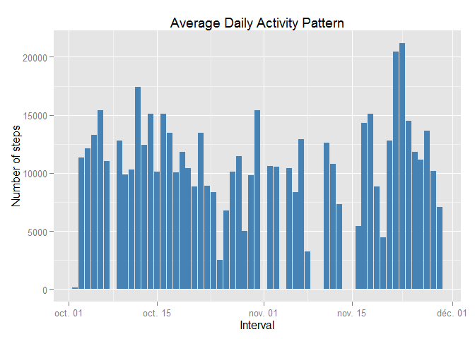
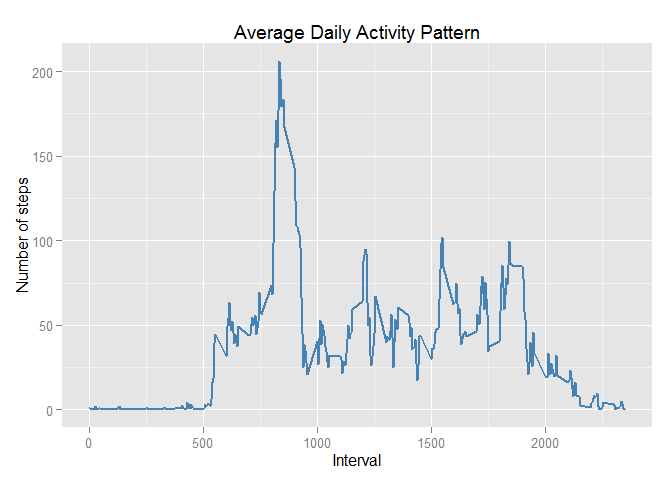
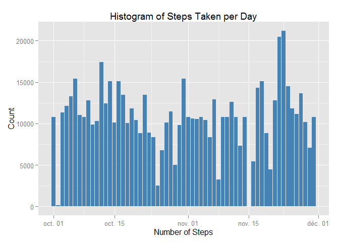
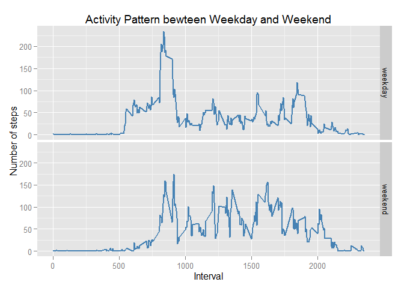

# Reproducible Research: Peer Assessment 1
This assignment focuses on the data of activity monitoring devices. Our data consists of the number of steps taken in 5 minute interval each day during two months. 

This report is written in R Markdown language which is a simple formatting syntax for authoring web pages.

```r
library(ggplot2)
```

## Loading and preprocessing the data

```r
setwd("D:/Coursera/ReproducibleResearch/RepData_PeerAssessment1")
unzip("activity.zip")
activity <- read.csv("activity.csv", header=T, colClasses=c("numeric", "character", "numeric"))
activity$interval <- factor(activity$interval)
activity$date <- as.Date(activity$date, format="%Y-%m-%d")
```


## What is mean total number of steps taken per day?
1. Make a histogram of the total number of steps taken per day

```r
steps_per_day <- aggregate(steps ~ date, activity, sum)
colnames(steps_per_day) <- c("date", "steps")
ggplot(steps_per_day, aes(x=date, y=steps)) +
geom_histogram(fill="steelblue" , stat="identity") +
labs(title="Average Daily Activity Pattern", x="Interval", y="Number of steps") 
```

 

2. Calculate the mean ad median of the total number pf steps taken per day

```r
round(mean(steps_per_day$steps), 0)
```

```
## [1] 10766
```

```r
round(median(steps_per_day$steps), 0)
```

```
## [1] 10765
```

## What is the average daily activity pattern?
1. Make a time series plot bewteen interval and average number of steps 

```r
steps_per_interval <- aggregate(steps ~ interval, activity, mean)
steps_per_interval$interval = as.integer(levels(steps_per_interval$interval))[steps_per_interval$interval]
ggplot(steps_per_interval, aes(x=interval, y=steps)) +
geom_line(color="steelblue", size=1) +
labs(title="Average Daily Activity Pattern", x="Interval", y="Number of steps") 
```

 

2. Find the 5-min interval which contains the maximum number of steps

```r
steps_per_interval$interval[which.max(steps_per_interval$steps)]
```

```
## [1] 835
```

## Imputing missing values
1. Calculate the total number of missing values in the dataset

```r
sum(is.na(activity))
```

```
## [1] 2304
```

2. Replace the missing values with original mean value and creat a new dataset

```r
activity2 <- merge(activity, steps_per_interval, by = "interval", suffixes = c("", ".y"))
nas <- is.na(activity2$steps)
activity2$steps[nas] <- activity2$steps.y[nas]
activity2 <- activity2[, c(1:3)]
```

3. Make a histogram of the total number of steps taken per day

```r
steps_per_day2 <- aggregate(steps ~ date, activity2, sum)
colnames(steps_per_day2) <- c("date", "steps")
ggplot(steps_per_day2, aes(x=date, y=steps)) +
geom_histogram(fill="steelblue", stat="identity") +
labs(title="Histogram of Steps Taken per Day", x="Number of Steps", y="Count") 
```

 

4. Calculate the mean ad median of the total number pf steps taken per day

```r
round(mean(steps_per_day2$steps), 0)
```

```
## [1] 10766
```

```r
round(median(steps_per_day2$steps), 0)
```

```
## [1] 10766
```

5. There is no great difference between the estimates and the first part of this assignment. That is to say, the impact of imputing missing data on the estimates of the total daily number of steps in quite low.

## Are there differences in activity patterns between weekdays and weekends?
1. Creat a new factor variable "dayofweek" in the dataset "activity"

```r
dayofweek <- function(date) {
  if (weekdays(as.Date(date)) %in% c("Saturday", "Sunday")) {
    "weekend"
  } else {
    "weekday"
  }
}
activity$dayofweek <- as.factor(sapply(activity$date, dayofweek))
head(activity)
```

```
##   steps       date interval dayofweek
## 1    NA 2012-10-01        0   weekday
## 2    NA 2012-10-01        5   weekday
## 3    NA 2012-10-01       10   weekday
## 4    NA 2012-10-01       15   weekday
## 5    NA 2012-10-01       20   weekday
## 6    NA 2012-10-01       25   weekday
```

2. Make a panel plot to compare the activity patterns between workdays and weekend

```r
steps_daytype <- aggregate(steps ~ interval+dayofweek, activity, mean)
steps_daytype$interval = as.integer(levels(steps_daytype$interval))[steps_daytype$interval]
ggplot(steps_daytype, aes(x=interval, y=steps)) +
facet_grid(dayofweek ~ .) +
geom_line(color="steelblue", size=1) +
labs(title="Activity Pattern bewteen Weekday and Weekend", x="Interval", y="Number of steps") 
```

 

##the end
